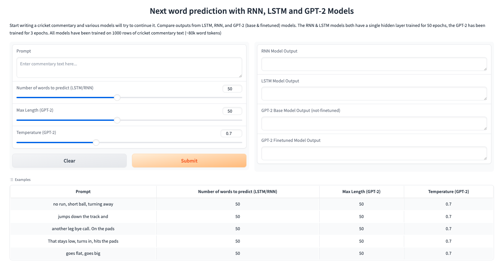

# NLP-Application

## Introduction
This project involves developing and comparing next-word prediction models using various architectures, including RNN, LSTM, GPT-2 (base), and GPT-2 (fine-tuned). The aim is to evaluate the performance of these models in predicting the next word in a sequence of cricket commentary texts.

## Motivation
The motivation behind this project is to explore the capabilities of different neural network architectures in the context of natural language processing (NLP) tasks. Specifically, we focus on next-word prediction, a fundamental task with applications in text completion, chatbots, and language modeling. By comparing the performance of RNN, LSTM, and GPT-2 models, we aim to identify the most effective approach for this task.

## Related Work
Numerous studies have explored next-word prediction using various neural network architectures. RNNs and LSTMs are widely used for sequential data tasks, while transformer-based models like GPT-2 have shown significant improvements in NLP benchmarks. This project builds on these existing works by providing a comparative analysis of these models in the specific context of cricket commentary.

## Data and Pre-processing
The dataset consists of 1000 rows of cricket commentary text, amounting to approximately 80k word tokens. The data was pre-processed to remove any irrelevant information and formatted into a structure suitable for training the models. Key pre-processing steps included tokenization, removing special characters, and converting text to lowercase.

## Model Architecture
•⁠  ⁠*RNN Model*: A simple Recurrent Neural Network with a single hidden layer.
•⁠  ⁠*LSTM Model*: An LSTM network with a single hidden layer to capture long-term dependencies.
•⁠  ⁠*GPT-2 Base Model*: The pre-trained GPT-2 model without any fine-tuning.
•⁠  ⁠*GPT-2 Fine-tuned Model*: The GPT-2 model was fine-tuned on the cricket commentary dataset for better domain-specific predictions.

## Model Training Setting
•⁠  ⁠*RNN & LSTM*: Both models were trained with a single hidden layer for 50 epochs.
•⁠  ⁠*GPT-2 Models*: The base GPT-2 model was used as-is, while the fine-tuned GPT-2 model was trained for 3 epochs on the cricket commentary dataset.

## Results
The models' outputs were compared using a web interface developed with Gradio. Users can input a prompt, adjust the number of words to predict, max length, and temperature settings for the GPT-2 models, and view the outputs from each model side by side.

### Example Prompts and Outputs

[Hugging Face Link](https://huggingface.co/spaces/himanishprak23/Cricket-commentary-generation)

## Conclusion
The comparative analysis of RNN, LSTM, GPT-2 base, and GPT-2 fine-tuned models provides insights into the strengths and weaknesses of each architecture for next-word prediction in cricket commentary. While transformer-based models like GPT-2 show superior performance, RNN and LSTM offer competitive results with simpler architectures.

## Future Work
Future work involves further fine-tuning and experimenting with different hyperparameters to enhance model performance. Additionally, expanding the dataset and exploring other transformer-based models could provide more robust solutions for next word prediction tasks.
